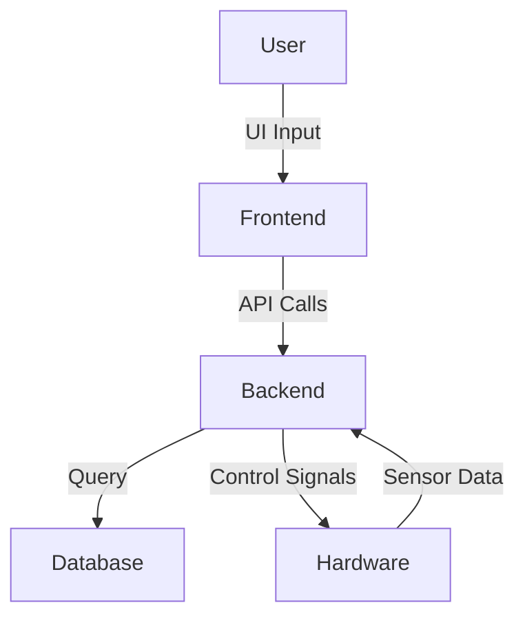

# 🚀 Project Title: Smart-Power-Management-SPM-client


## 📌 Overview
A smart power management system using ESP32 for real-time monitoring and automatic switching between primary and backup power sources. It features load balancing, overcurrent protection, and is ideal for smart homes and IoT-based microgrid applications.

## 🧠 Key Features
- ✅ Real-time tracking / smart control
- ✅ Real-time power monitoring and logging
- ✅ Automatic source switching based on thresholds
- ✅ Intelligent load balancing
- ✅ Overcurrent protection

## 🛠️ Technologies Used

### 💻 Frontend


### 🗄️ Database


### ⚙️ Hardware (if applicable)


## 🧩 Available Platforms
- 📱 Android
- 🚀 Embedded (ESP32)

## ⚙️ System Architecture
> _Using bluetooth it can Config and Tranfer Data to android APP ._


## 📸 Screenshots / Demo

| Mobile View | Hardware Setup |
|-------------|----------------|
| | |


## 📱 Installation & Setup

### Prerequisites
- [ ] Flutter SDK 
- [ ] Android Studio

### Setup Steps
```bash
# Clone the repository
git clone https://github.com/Raghavan2005/Smart-Power-Management-SPM-client.git
cd Smart-Power-Management-SPM-client

# Install dependencies
flutter pub get     # For Flutter frontend

# Run the Flutter app
flutter run
```

## 📄 License
This project is licensed under the [MIT License](LICENSE).
